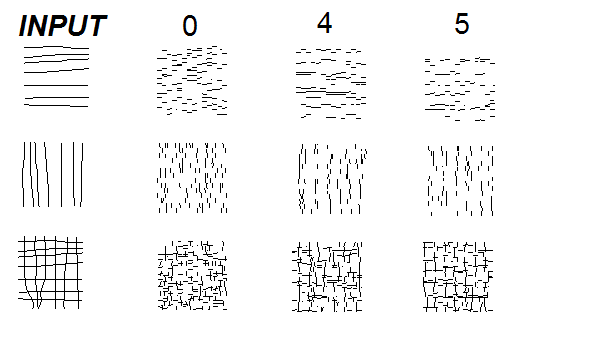

# wavefunction-collapse

A proceedural image generator using a probability wavefunction collapse algorithm. Every 3x3 pixel grid exists as a superposition of all possible allowed 3x3 pixel grids according to an internal set of rules, and as each pixel updates it affects the superposition of the rest of the image by disallowing/allowing various of the possible configurations.

|*Sample 1*|*Sample 2*|
|:---:|:---:|
| ||
| No white deadends rule | No white dead ends OR intersections rule

If you look closely at the boundaries between the collapsed and uncollapsed regions on the closeup (below), you can see the various superpositions per-pixel as varying shades of gray (brighter = more likely to be white).

 |

The first version of this code, the simplesnake program, uses hardcoded manually set rules (see above), which is an effective proof of concept but obviously of limited use.

Markov Chaining To Infer Rulesets
--------------

Eventually I decided I wanted to experiment with letting the algorithm try and decide its own rules based on a training image instead of a hardcoded set. I think in theory the concept should be very similar to a Markov chain, but a 2-dimensional one, if that makes sense.

This much more ambitious goal (of learning based on a training image and switching from a binary allowed/disallwed ruleset to a Markov-style probabilistic one) is partially implemented in the intermediate_snake.py program, which is VERY much in-progress. At the moment it performs well at replicating local structures, but fails to capture the bulk properties of the sample image in any meaningful way. I guess I am know learning why machine learning was invented, ha ha - this stuff is HARD.

My mediocre progress so far is above.
